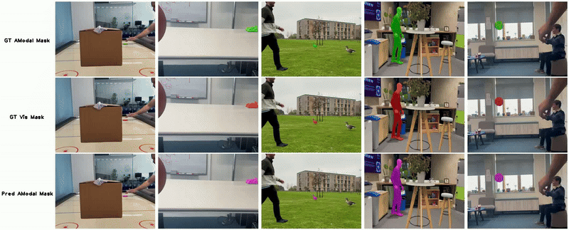

# Track Anything Behind Everything: Zero-Shot Amodal Video Object Segmentation (TABE)

[Finlay GC Hudson](https://finlay-hudson.github.io/), [William AP Smith](https://www-users.york.ac.uk/~waps101/)

University of York 

[Paper](https://arxiv.org/pdf/2411.19210) | [Project Page](https://finlay-hudson.github.io/tabe/) | [TABE-51 Dataset](https://drive.google.com/file/d/1q5u8aqCt2lZUYVb1M9XuveSi7U1EGP7G/view?usp=sharing) | [TABE-51 Dataset Generation Code](https://github.com/finlay-hudson/TABE51-generation)


## Setup

Clone this repository and then update submodules with:

`git submodule update --init --recursive`

Make venv in preferred format - for instruction, venv will be shown
```
python3 -m venv tabe_venv
source tabe_venv/bin/activate
pip install -r requirements.txt
cd third_party/segment-anything-2
pip install -e .
```

Versions in the `requirements.txt` file, are ones that we tested on. But that's not to say different versions of torch etc. won't work

## Computation Requirements
This is all tested on Nvidia A40 GPU's, but required VRAM is at least 32GB for the full pipeline

## Pretrained Models
1. Download the [Stable Diffusion v1.5 Inpainting](https://huggingface.co/botp/stable-diffusion-v1-5-inpainting) model
   2. We use [git lfs]((https://docs.github.com/en/repositories/working-with-files/managing-large-files/installing-git-large-file-storage)) to do this:
   ```
    # To install git lfs (on Ubuntu: else follow
    curl -s https://packagecloud.io/install/repositories/github/git-lfs/script.deb.sh | sudo bash
    sudo apt-get install git-lfs
   
    # To get the model
    git lfs install
    git clone https://huggingface.co/botp/stable-diffusion-v1-5-inpainting
    ```
3. Download the [CoCoCo](https://github.com/zibojia/COCOCO) [checkpoints](https://mycuhk-my.sharepoint.com/personal/1155203591_link_cuhk_edu_hk/_layouts/15/onedrive.aspx?id=%2Fpersonal%2F1155203591%5Flink%5Fcuhk%5Fedu%5Fhk%2FDocuments%2Fckpt&ga=1). 
3. Download the SAM2 [checkpoint](https://huggingface.co/facebook/sam2-hiera-large)


## Runtime Configs

### Model Paths

Within `src/tabe/configs/runtime_config.py`, update:

- `RuntimeConfig.sam_checkpoint`. To be the file path of the downloaded SAM2 checkpoint .pth file. `"checkpoints/sam2/sam2_hiera_large.pt"`

Within `src/tabe/configs/video_diffusion_config.py`, update:

- `VideoDiffusionConfig.sd_inpainting_model_path`. To be the root directory containing the downloaded [Stable Diffusion v1.5 Inpainting](https://huggingface.co/benjamin-paine/stable-diffusion-v1-5-inpainting) model. Defaults to `"checkpoints/stable-diffusion-v1-5-inpainting"`
- `VideoDiffusionConfig.cococo_unet_weights`. To be the directory containing the 4 checkpoint files downloaded in [Pretrained Models (2)](#pretrained-models). Defaults to `"checkpoints/cococo"`

### Dataset Paths
#### Dataset Structure
```
Datasets expected to be in the structure:

video_name/
├── frames/          # All frames of the video in numerical ordere
├── visible_masks/   # Visible masks in numerical order (must include at least the query mask)
├── gt_masks/        # (Optional) Ground truth amodal masks for frames
└── annos.json       # (Optional) File with a dict of {"occlusion": [{"level": occlusion level strings, mapped to OcclusionLevel, "amount": float amount of occlusion}]}

Example of this structure shown in: examples/
```

Update `DataConfig.output_root` to be the directory for model predictions to be saved (default: `outputs`)
Trained models will also be saved here if `VideoDiffusionTrainingConfig.no_cache` is set to `False`, we default this to `True` however as these models take a good amount of space!

For running TABE51 dataset, download data from [here](https://drive.google.com/file/d/1q5u8aqCt2lZUYVb1M9XuveSi7U1EGP7G/view?usp=sharing) and set:
- `RuntimeConfig.dataset` to `DatasetTypes.TABE51`
- `DataConfigTABE.data_root`. To be the root directory of TABE51, should end with `data` directory

For running Custom dataset, set:
- `RuntimeConfig.dataset` to `DatasetTypes.CUSTOM`
- `DataConfigCustom.data_root` Directory of custom dataset, aligned with [Dataset Structure](#dataset-structure)
- `DataConfigCustom.frame_dir_name` Name of the directory containing the frames. Defaults to `frames`
- `DataConfigCustom.vis_mask_dir_name` Name of the directory containing the visible modal masks. Defaults to `visible_masks`

_ Additional optional extra data configs are found in `src/tabe/configs/runtime_config.py`_

## Running
### Run the example

[//]: # (TODO if they cant train the model - provide pretrained weights for this video)
We provide a short example video from our TABE51 dataset, to showcase running on a video with a single query mask.
To run the example, set:
- `RuntimeConfig.dataset` to `DatasetTypes.CUSTOM`
- `RuntimeConfig.video_names` to `tuple(["air_hockey_1"])`

Then run:
`PYTHONPATH=. python src/runner.py`

If needing to run on a specific GPU idx run with:
`CUDA_VISIBLE_DEVICES=<GPU_IDX> PYTHONPATH=. python src/runner.py`

## Evaluation 

Once the amodal segmentation masks have been produced, we provide code to evaluate results on our **TABE51** dataset.

`PYTHONPATH=. python src/eval_tabe51.py`

## BibTeX Citation

If you utilise our code and/or dataset, please consider citing our paper:
```
@article{hudson2024track,
  title={Track Anything Behind Everything: Zero-Shot Amodal Video Object Segmentation},
  author={Hudson, Finlay GC and Smith, William AP},
  journal={arXiv preprint arXiv:2411.19210},
  year={2024}
}
```


## Misc 

We welcome any contributions or collaborations to this work. Also any issues found, we will try and help as best we can in the Issues section :)